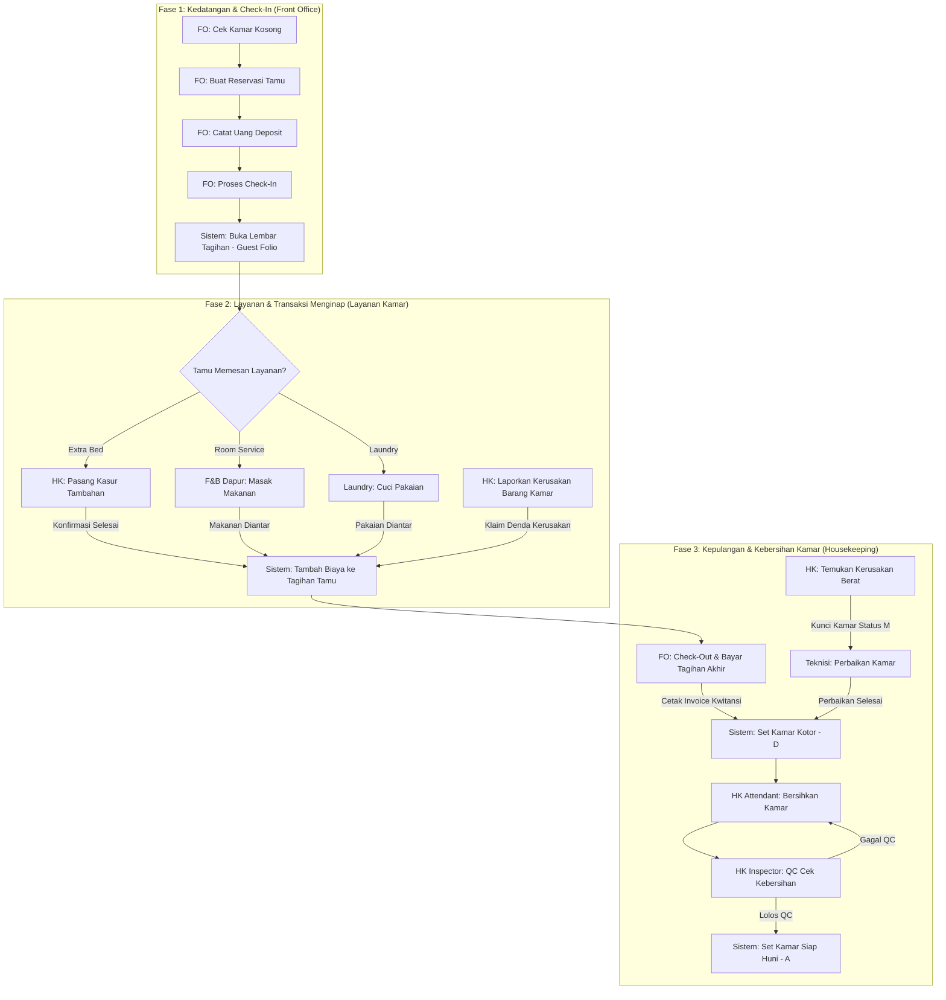

# Panduan Lengkap Hotel Management System (HMS) - PPKD Hotel

Selamat datang di dokumentasi project **Hotel Management System (HMS) PPKD Hotel**! Project ini dibangun menggunakan **Laravel 12**, **SQLite**, dan template UI premium **AdminHMD**. 

Dokumentasi ini dibuat dengan bahasa yang santai dan mudah dipahami agar kamu bisa mempelajari alur kerja aplikasi, database (ERD), arsitektur web, hingga sistem desainnya secara menyeluruh.

---

## 1. Alur Kerja Aplikasi (System Operational Flow)

Website ini menyatukan semua aktivitas hotel dalam satu alur kerja terpadu. Agar lebih mudah dipahami, alur kerjanya dibagi menjadi **3 Fase Utama**:



### Penjelasan Detil Tiap Fase:

#### **Fase 1: Kedatangan & Check-In (Siklus Awal Tamu)**
* **Pengecekan Kamar:** Staff Front Office (FO) melihat peta kamar untuk mencari kamar kosong dengan status `Available (A)`.
* **Input Reservasi & Jaminan:** FO memasukkan identitas tamu (KTP/Passport), tanggal inap, serta menerima uang jaminan (*deposit*).
* **Pembuatan Folio Otomatis:** Begitu tamu masuk (*check-in*), sistem langsung membuat lembar tagihan (**Guest Folio**). Biaya sewa kamar otomatis masuk ke tagihan beserta pajak daerah (10%) dan biaya layanan (5%).

#### **Fase 2: Layanan Selama Menginap (Siklus Transaksi Aktif)**
Tamu dapat memesan berbagai layanan tambahan, yang otomatis saling terhubung antardivisi:
* **Kasur Tambahan (Extra Bed):** FO mencatat pesanan, tim Housekeeping (HK) memasang kasur di kamar tamu, lalu HK mengonfirmasi selesai. Biaya kasur otomatis ditambahkan ke Guest Folio tamu.
* **Pemesanan Makanan Kamar (Room Service):** Koki dapur (F&B) menerima antrean pesanan masak secara *real-time*. Begitu makanan matang dan diantarkan ke kamar (*Delivered*), biaya makanan langsung masuk ke Guest Folio.
* **Cuci Pakaian (Laundry):** Staff laundry mencuci pakaian kotor tamu melalui antrean mesin cuci. Saat pakaian bersih diantarkan kembali ke kamar, biaya laundry langsung tertagih ke Guest Folio.
* **Denda Kerusakan (Damage Charge):** Jika staff HK menemukan fasilitas kamar dirusak tamu, staff HK menginput denda yang otomatis ditambahkan ke tagihan akhir tamu.

#### **Fase 3: Kepulangan & Kebersihan Kamar (Siklus Akhir)**
* **Pelunasan & Check-Out:** FO menghitung total tagihan di Guest Folio dikurangi deposit awal tamu. Tamu membayar sisa tagihan, lalu FO memproses *Check-out* dan mencetak **Invoice** resmi.
* **Pembersihan Kamar:** Sistem otomatis mengubah status kamar yang baru ditinggali menjadi **Dirty (D)** dan membuat daftar tugas pembersihan baru untuk tim Housekeeping.
* **Inspeksi Kualitas (QC):** Setelah kamar dibersihkan oleh staff *attendant*, *Inspector* melakukan pemeriksaan kualitas. Jika lulus QC, kamar berubah status menjadi **Available (A)** (Siap disewakan kembali). Jika gagal, kamar harus dibersihkan ulang.
* **Perbaikan Teknis (Maintenance):** Jika ditemukan kerusakan berat saat kamar kosong, kamar dikunci dengan status **Maintenance (M)** untuk diperbaiki oleh teknisi. Setelah selesai diperbaiki, kamar dikembalikan ke status Kotor untuk dibersihkan sebelum siap huni kembali.

---

## 2. Struktur Database (Entity Relationship Diagram - ERD)

Aplikasi ini menggunakan database ringan **SQLite**. Berikut adalah diagram relasi antartabel di dalam sistem:

```mermaid
erDiagram
    users ||--o{ housekeeping_tasks : "mengerjakan"
    users ||--o{ damage_reports : "melaporkan"
    users ||--o{ lost_found_reports : "melaporkan"
    users ||--o{ maintenance_requests : "melaporkan"
    
    room_types ||--o{ rooms : "mengelompokkan"
    rooms ||--o{ reservations : "ditempati"
    rooms ||--o{ housekeeping_tasks : "dibersihkan"
    rooms ||--o{ damage_reports : "mengalami_kerusakan"
    rooms ||--o{ lost_found_reports : "ditemukan_barang"
    rooms ||--o{ maintenance_requests : "diperbaiki"

    guests ||--o{ reservations : "memesan"
    guests ||--o{ damage_reports : "bertanggungjawab"

    reservations ||--o{ deposits : "membayar"
    reservations ||--o{ extrabed_requests : "meminta"
    reservations ||--o{ fb_orders : "memesan_makanan"
    reservations ||--o{ laundry_orders : "mencuci_baju"
    reservations ||--one|| guest_folios : "memiliki"

    guest_folios ||--o{ guest_folio_items : "mencatat_transaksi"
    
    fb_menus ||--o{ fb_order_items : "dipesan"
    fb_orders ||--o{ fb_order_items : "berisi"
    
    laundry_services ||--o{ laundry_orders : "memilih_layanan"
    laundry_orders ||--o{ laundry_order_items : "berisi"
    laundry_orders ||--o{ laundry_damage_reports : "mencatat_klaim"

    housekeeping_tasks ||--one|| room_inspections : "diperiksa"
```

### Penjelasan Tabel Utama:
* **`users`**: Menyimpan akun pegawai (Admin, Front Office, Housekeeping, F&B).
* **`rooms` & `room_types`**: Data kamar hotel (Nomor kamar, lantai, kapasitas, fasilitas) beserta tipe kamarnya (Standard, Deluxe, Suite, dsb.).
* **`guests`**: Profil lengkap tamu seperti nomor KTP/Passport, nama, no HP, negara asal, dan plat nomor kendaraan.
* **`reservations`**: Data transaksi booking tamu, tanggal menginap, harga sewa, dan status reservasi.
* **`deposits`**: Pencatatan uang muka jaminan (DP) tamu saat awal check-in atau pelunasan.
* **`guest_folios` & `guest_folio_items`**: Catatan ledger tagihan tamu. Setiap transaksi makanan, laundry, kasur tambahan, atau denda kerusakan akan tercatat otomatis di sini sebagai satu kesatuan tagihan.
* **`fb_orders` & `laundry_orders`**: Antrean pesanan makanan kamar dan pencucian pakaian tamu yang diinput dari FO atau staff terkait.
* **`housekeeping_tasks` & `room_inspections`**: Tugas pembersihan kamar bagi staff dan penilaian kualitas kelayakan kamar oleh inspektur.

---

## 3. Arsitektur Web (Web Architecture)

Aplikasi ini menggunakan pola arsitektur **MVC (Model-View-Controller)** bawaan Laravel:

* **Model (Database Wrapper):** Seluruh logika database didefinisikan menggunakan Eloquent ORM di dalam folder `app/Models/`. Relasi data antar-tabel ditulis dengan rapi menggunakan fungsi seperti `belongsTo`, `hasMany`, dan `hasOne`.
* **Routing & Middleware (Keamanan & Akses):**
  Rute web didefinisikan di `routes/web.php`. Untuk keamanan akses, aplikasi menggunakan [RoleMiddleware](file:///c:/xampp/htdocs/hotel-project/app/Http/Middleware/RoleMiddleware.php). Setiap halaman dibatasi berdasarkan divisi pegawai, misalnya:
  - Menu kelola Master Data hanya bisa dibuka oleh **Admin**.
  - Menu pemesanan kamar dan transaksi keuangan hanya bisa dibuka oleh **Front Office** dan **Admin**.
  - Menu pembersihan kamar, inspeksi, dan gudang perbaikan hanya bisa dibuka oleh **Housekeeping** dan **Admin**.
  - Menu pemesanan makanan dapur hanya bisa dibuka oleh **F&B Staff** dan **Admin**.
* **Controller (Logika Utama):** Folder `app/Http/Controllers/` bertugas menghubungkan Model dengan View. Contohnya, saat status laundry diubah menjadi `Delivered` oleh [LaundryController](file:///c:/xampp/htdocs/hotel-project/app/Http/Controllers/LaundryController.php), sistem otomatis memicu perintah untuk membuat data tagihan baru di tabel `guest_folio_items`.
* **Views (Tampilan):** Menggunakan sistem template Blade Laravel di `resources/views/`. Struktur layouts dipisah agar header, sidebar, dan footer hanya ditulis sekali di [admin.blade.php](file:///c:/xampp/htdocs/hotel-project/resources/views/layouts/admin.blade.php), sementara halaman lainnya tinggal mewarisi (*inherit*) kerangka layout tersebut.

---

## 4. Sistem Desain (Design System)

Tampilan aplikasi ini dirancang secara premium menggunakan kombinasi framework CSS dan kustomisasi tambahan:

* **Framework CSS:** Menggunakan **Bootstrap 5** sebagai pondasi utama untuk grid tata letak, tombol, tabel responsif, formulir, dan modal popup.
* **Tipografi:** Menggunakan font modern **Poppins** dari Google Fonts untuk memberikan kesan bersih, premium, dan mudah dibaca oleh staff hotel.
* **Palet Warna HMS (Harmonis & Curated):**
  - Kamar Tersedia (*Available*): Hijau Emerald (`#22c55e` / `success`)
  - Kamar Terisi (*Occupied*): Biru Royal (`#3b82f6` / `primary`)
  - Kamar Kotor (*Dirty*): Merah Crimson (`#ef4444` / `danger`)
  - Kamar Sedang Dibersihkan (*Cleaning*): Amber/Kuning Kunyit (`#f59e0b` / `warning`)
  - Kamar Perbaikan (*Maintenance*): Abu-abu Gelap (`#4b5563` / `dark`)
  - Kamar Terpesan (*Reserved*): Biru Langit (`#0ea5e9` / `info`)
* **Mode Tampilan:** Mendukung **Mode Terang (Light)** dan **Mode Gelap (Dark Mode)** secara instan. Pilihan tema ini disimpan ke penyimpanan lokal browser (*localStorage*) sehingga tema tidak akan berubah saat halaman dimuat ulang.
* **Sistem Cetak Dokumen (Print System):**
  Semua lembar bukti cetak (Kartu Registrasi Tamu, Requisition Kasur Tambahan, Voucher Kasir, dan Invoice Tagihan Akhir) menggunakan manipulasi styling khusus `@media print`. Saat tombol cetak ditekan, browser otomatis menyembunyikan navigasi samping (sidebar), navigasi atas (navbar), tombol-tombol aksi, dan footer, sehingga hanya menyisakan lembar dokumen formal berwarna hitam-putih yang rapi dan siap dicetak atau disimpan sebagai PDF secara instan.

---

## 5. Panduan Menjalankan Aplikasi (Quickstart)

Berikut langkah mudah untuk menjalankan aplikasi ini di komputer lokal kamu:

### Langkah 1: Pasang Dependencies PHP
Buka terminal/CMD di direktori project ini, lalu jalankan:
```bash
composer install
```

### Langkah 2: Buat Database & Demo Data
Jalankan perintah berikut untuk mengosongkan database lama, membuat tabel-tabel baru, dan mengisi data uji coba (seperti daftar kamar awal, makanan, dan akun pegawai):
```bash
php artisan migrate:fresh --seed
```

### Langkah 3: Jalankan Server Lokal
```bash
php artisan serve
```
Setelah berjalan, buka browser dan akses link: [http://localhost:8000](http://localhost:8000)

---

## 6. Daftar Akun Uji Coba (Demo Accounts)

Kamu bisa masuk menggunakan akun-akun uji coba di bawah ini untuk melihat perbedaan menu dashboard pada masing-masing tugas divisi:

| Divisi / Peran | Alamat Email | Password | Hak Akses Utama |
| :--- | :--- | :--- | :--- |
| **Hotel Administrator** | `admin@ppkdhotel.com` | `admin123` | Semua menu operasional, manajemen pegawai (Master Data), dan laporan analytics keuangan. |
| **Front Office Staff** | `fo@ppkdhotel.com` | `fo123` | Cek ketersediaan kamar, reservasi, check-in/out tamu, pembayaran deposit, cetak kwitansi & invoice. |
| **Housekeeping Staff** | `hk@ppkdhotel.com` | `hk123` | Mengubah status pembersihan kamar, input QC inspeksi kelayakan, laporan kerusakan barang, barang hilang, dan maintenance. |
| **F&B Kitchen Staff** | `fb@ppkdhotel.com` | `fb123` | Melihat menu sarapan tamu menginap harian dan mengelola antrean pesanan room service dapur hotel. |

### Langkah 4: Jalankan Test Otomatis (Opsional)
Untuk memastikan seluruh fungsi pemrograman dan rute sistem berjalan dengan baik tanpa error:
```bash
php artisan test
```
Jika keluar teks **PASS**, berarti seluruh sistem kode aman dan berfungsi normal.
